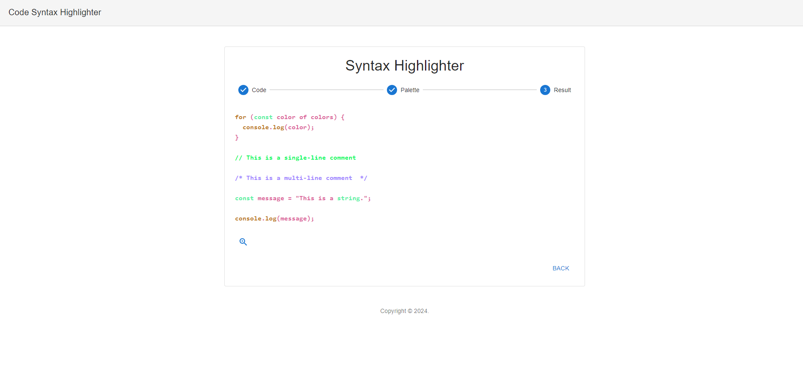
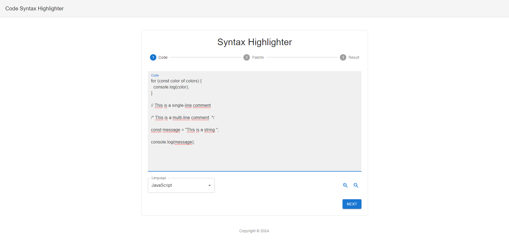
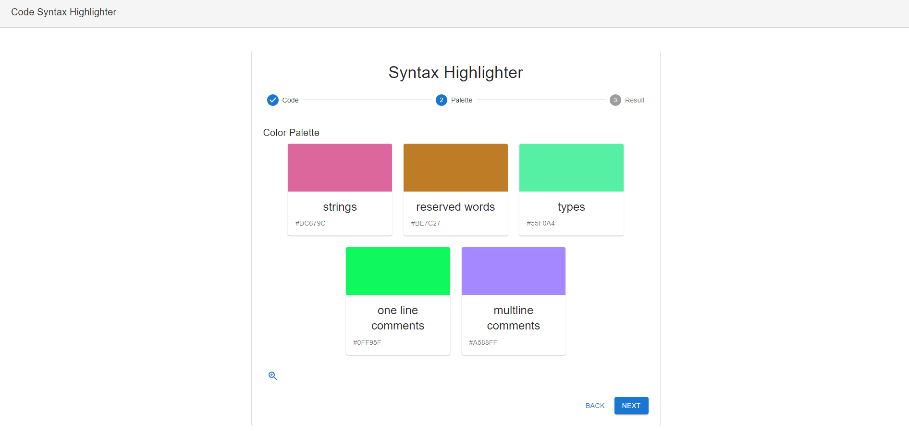

# Syntax Highlighter


<br>
<div align="center">
  
</div>

> A basic application that highlights code syntax in different programming languages. Built as a way to practice React and improve regex skills.

---

## 🛠️ Features

- **Syntax Highlighting**: Supports JavaScript, Java, Python, and more.
- **Customizable Palette**: Allows users to pick unique color schemes.
- **Real-Time Results**: View syntax highlighting instantly.

---

## 🎨 User Interface

<div align="center" style="display: flex; flex-wrap: wrap; gap: 10px;">
  
  
</div>

---

## 💻 Installation

Before you start, ensure you have **Node.js** and **npm** installed.

1. Clone the repository:

   ```bash
   git clone https://github.com/giovananog/syntax-highlighter-app.git
   ```

2. Navigate to the project directory and install dependencies:

   ```bash
   cd syntax-highlighter-app
   npm install
   ```

3. Start the application:

   ```bash
   npm start
   ```

4. Open the app in your browser at: [http://localhost:3000](http://localhost:3000)

---

## 🚀 How to Use

1. **Code**: Insert your code in the "Code" section.
2. **Palette**: Customize your color scheme in the "Palette" section.
3. **Result**: See the highlighted code in the "Result" section.

